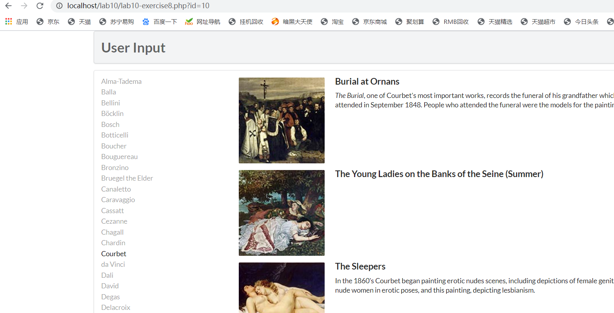

# lab10设计文档 
## exercise7 
 
 
pdo和mysqli流程挺相似的。 
第一步建立数据库连接，这个步骤在pdo里是 
`$pdo=new PDO(DBCONNSTRING,DBUSER,DBPASS);`
在mysqli里是 
`$connection=mysqli_connect(DBHOST,DBUSER,DBPASS,DBNAME);`
然后处理可能的连接错误。在pdo里是try catch语句，在mysqli用了一个if  
成功建立连接后在连接上执行SQL语句，并将其得到其结果。在pdo里使用 
`$result = $pdo->query($sql);`
`while($row=$result->fetch()){}`
把结果放在$result里，再取每一记录为$row 
而mysqli则是使用 
`if($result=mysqli_query($connection,$sql)){}`
`while($row=mysqli_fetch_assoc($result)){}`
最后将资源释放，关闭连接： 
`$pdo=null;`
`mysqli_free_result($result);mysqli_close($connection);`
## exercise8 
 
exercise8的代码实现了根据艺术家的名字筛选他的作品。其连接到数据库的方法与之前一样  
其中，outputArtist()方法获取艺术家信息打印成一系列的超链接，按照LastName排序，并取从0开始的30个人。每个艺术家的href为原来地址加上“?id=xxx”，即设置id的参数，方便后续筛选图片。用$_GET['id']获取当前页面的id参数，如果id参数与某个artistID相等，代表目前正在他的那一页，则在class中添加‘active’，显示不同样式。这样就实现了当前在哪里，那个链接就高亮显示  
outputPaintings()方法实现打印当前页面的艺术家的作品：  
`$sql='select * from Paintings where ArtistId='.$_GET['id'];`
起到了筛选作用。其中的outputSinglePainting()用于打印单张画及其信息  
outputSinglePainting()方法获取一个$row,将其中信息打印出来。其中用：  
`echo ''`
就能打印正确的照片  
## exercise9 
查询到，通过pdo执行sql语句有三种方法。  
第一种是exec()方法，通过$pdo->exec($query)，返回受影响的行数   
第二种是query()方法，即之前使用的$result = $pdo->query($sql);  
第三种是预处理语句：使用prepare()方法和execute()语句： 
`$statement=$pdo->prepare($sql);$statement->execute();`
使用预处理语句prepared statement有很多好处，其中包括：
1、能够灵活设置参数  
2、传输量小，性能更好  
3、防止sql注入式攻击  
## exercise10  
  
有三个方法
outputGenres()连接数据库之类的操作都与之前是一样的。在其中调用了outputSingleGenre($row)   
outputSingleGenre($row)方法打印出一张图片和与之配套的文字，调用到了constructGenreLink()  
constructGenreLink($id,$label)创建一个<a>，将其超链接设置为genre.php?id=xxx，读入$id值作为id，并且将$label作为<a>的内容，可以是也可以是文字。   