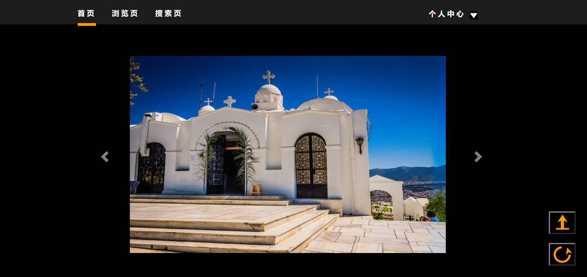

# 设计文档
首先引用bootstrap.min.css，jquery.min.js，bootstrap.min.js
基本布局与pj1中相同。在滑动图片部分，基本借鉴网上格式。使用了3个div来装图片，轮流播放。
将父div的class设为carousel slide来应用bootstrap的相关功能。data-ride设为carousel。
data-interval设置循环时间。data-pause = "hover"让鼠标悬浮时停止循环。data-wrap="true"使其连续循环
将对应的class设为对应的名字。用item avtive来设置一开始默认的照片
然后再使用两个按钮用来实现向左向右切换图片。一个data-slede是prev一个是next
使用id来设置图片样式，因为id特殊性高，可以盖过bootstrap中的图片样式
将其位置设为relative，再用left改变位置，做到随心所欲的布局

