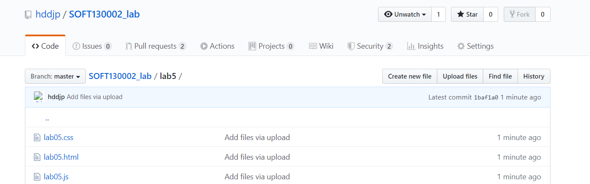
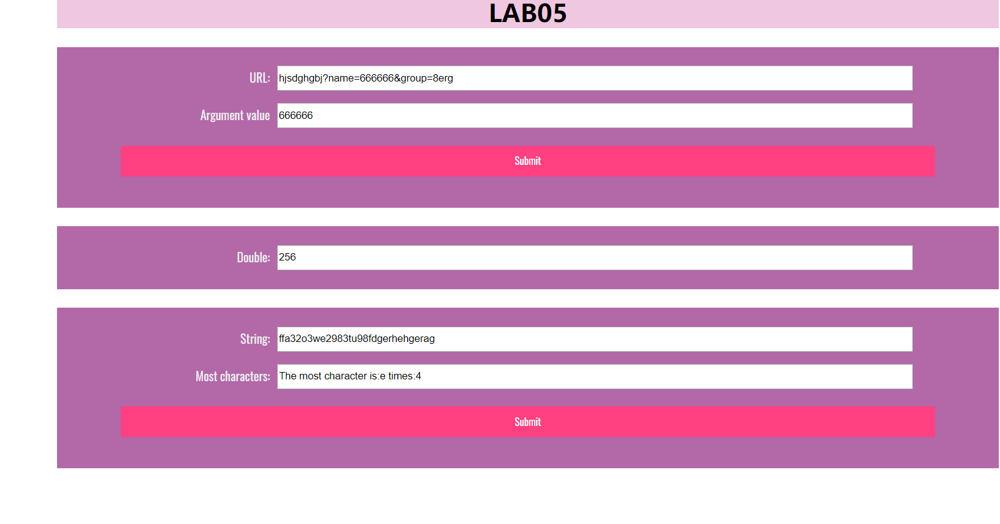

# lab5设计文档
  
  
***
第一个函数目的是在输入字符串中寻找匹配格式为“?name=...”或“&name=...”的部分，并将其之后的内容（直到&或者结束为止）作为name的参数值输出。  
先用数组把字符串分成一个一个字母的序列，然后用for循环进行匹配，寻找字符？和&，再看是否满足条件：该字符后面还有的个数大于5，以及后面是否是“name=”。都匹配成功则将其后面的字符串输出（到&或到结尾）  
```function showWindowHref(){
    let result="";
    let arr=url.value.split("");
    for(let i=0;i<arr.length;i++){
        if(arr[i]=="?"||arr[i]=="&"){
            if(arr.length>i+6){
                var attr=arr[i+1]+arr[i+2]+arr[i+3]+arr[i+4]+arr[i+5];
                if(attr=="name="){
                    var len=arr.length-i-6;
                    for(let k=i+6;k<arr.length;k++){
                        if(arr[k]=="&"){
                            len=k-i-6;
                        }
                    }
                    for(let j=0;j<len;j++){
                        result +=arr[i+6+j];
                    }
                }
            }
        }   
    }   
    url_result.value=result;
}
```
***
第二个函数使用了setTimeout函数。  
首先用window.onload来在载入是就运行timeTest。 
timeTest中先获取现在的秒数，再把（60-秒数）/5取整作为变化次数，如果次数大于10则只运行10次。  
隔时间翻一倍用for循环里的ti(a)函数实现，其中的a每过一个循环加一，setTimeout的两个参数分别为function(){mul.value*=2;}和5000*a。 
```let mul = document.getElementById("mul");
window.onload=function(){
    mul.value=1;
    this.timeTest();
}
function timeTest(){
    let time=new Date();
    second=time.getSeconds();
    let number=parseInt((60-second)/5);
    if(number>10){
        number=10;
    }
    for(let i=0;i<number;i++){
        ti(i+1);
    }
}
function ti(a){
     setTimeout(function(){
        mul.value *=2;
     },5000*a);
}
```
***
第三个函数使用面向对象 
在arrSameStr中创建class character，其中有一个构造函数和一个增加次数函数。一个对象代表一个字符，参数char是它的字符名称，参数time为此字符出现次数。 
之后用对象数组charArray来包含所有得到的对象实例。 
把输入的字符转换为数组，然后遍历数组中的元素，将元素与已有的对象实例对比，如果是同一个字符则个数加一，如果不同则用构造函数把这个字符新建为一个实例charArray[charArray.length]  
最后遍历对象数组中每一个成员，取最大次数和该次数的字符输出  
```function arrSameStr(){
    let index;
    let max=0;
    class character{
        constructor(char){
            this.char=char;
            this.time=1;
        }
        add(){
            this.time++;   
        }
    }
    let arr=most.value.split("");
    let charArray=new Array();
    for(let i=0;i<arr.length;i++){
        let repeat=false;
        q:for(let j=0;j<charArray.length;j++){
            if(arr[i]==charArray[j].char){
                charArray[j].add();
                repeat=true;
                break q;
            }
        }
        if(!repeat){
            charArray[charArray.length]=new character(arr[i]);
        }
    }
    for(let i=0;i<charArray.length;i++){
        if(charArray[i].time>max){
            max=charArray[i].time;
            index=charArray[i].char;
        }
    }
    result.value="The most character is:"+index+" times:"+max;
}
```
 
