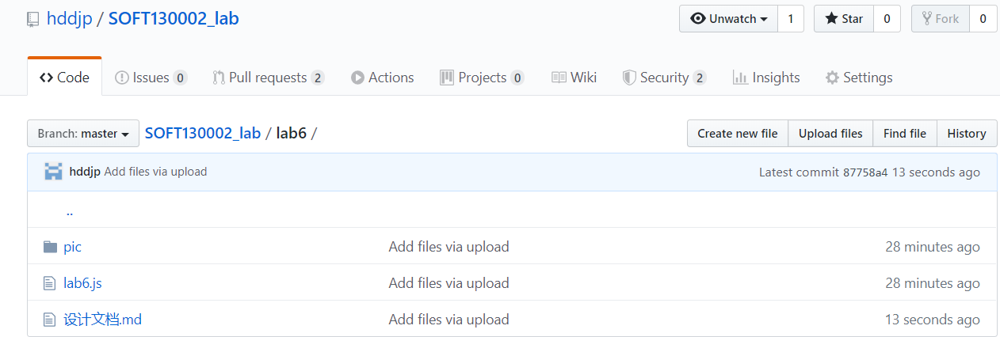
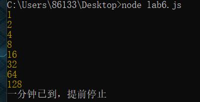
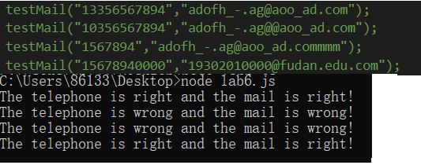
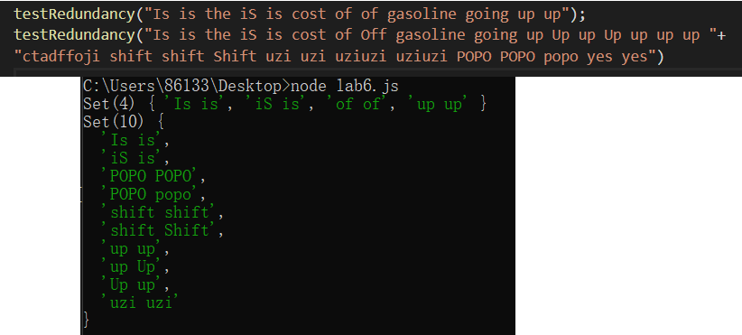
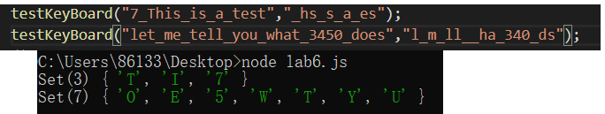
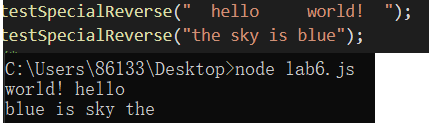
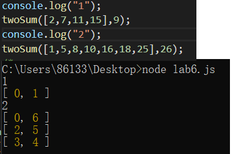
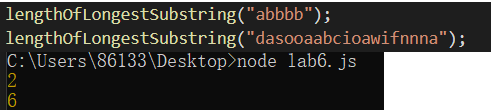
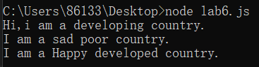

# lab6设计文档

## 正则表达式
### 电话号码正则表达式 
>/^1[34578]\d{9}$/
第一位是1，第二位是34578中的数字，后面跟九位数字 
### 邮箱正则表达式 
>/^[a-zA-z0-9]+([-_\.]*[a-zA-z0-9]+)*@([a-zA-z0-9]+[-_\.]?)*[a-zA-z0-9]+\.[a-zA-Z]{2,4}$/
@号前面是英文字母数字字符串，或者用-或_或.隔开的英文字母或者数字字符串，且特殊符号只能在中间出现。@之后也是这样的字符串，然后是.，.之后是2-4个字母的字符串，比如.com  .net 。 
### 紧连着多个相同单词正则表达式 
>/(\b[a-z]+\s)\1+/ig
首先匹配是不分大小写的全局匹配，所以是ig。内部是\b之后接着单词加上空格符\s，然后\1+代表之前括号中的内容重复二或多次 
## 继承 
### 构造函数继承 
相当于在子类的构造函数内部调用父类构造函数方法，并且新加子类的特有方法。所以这样新建的不同子类对象间属性不会互相影响。这种继承实际上原型并未指向父类对象，只是拥有了父类构造函数中定义的属性与方法。  
### 原型链继承 
这种继承应该比较经典，用子类的原型指向一个父类实例，然后再在子类原型上编辑属性与方法。这样的问题是当父类实例有引用类型属性时，会牵一发而动全身。还有在新建实例时难以直接传参，而上面的构造函数法可以  
### Object.create方法继承 
这种方法只能新建一个对象，为其绑定一个原型并且增加或覆盖属性。感觉不方便大量生成对象。而且同样有原型链继承的引用属性改变问题。（感觉新增属性也比较麻烦） 
以上三种都各有优缺点――所以在应用时可能倾向于使用基于class的继承~
## Array Set Map
使用下来感觉：  
### Array
Array类似于传统的数组，是有序数组，使用起来带下标，用for循环挺方便。 
增：array.push() / 直接下标操作 
删：array.pop()去除最后一个 / delete（留个undefined的坑） 
改：下标操作  
查：下标查询  
其他：split()将string拆成数组，join()把数组合成string。reverse()反转。长度为length
### Set
Set是无序数组，其中的内容不能重复，可以利用这个特性做一些事（比如用来判断字符串有没有重复字母）。  
增：set.add()  
删：set.delete()   
查：set.has()  
其他：new Set(array)用数组内容作为set的元素，也可以在括号内放置多个数组将其合并。可以用[...set]将set变成array。 
### Map
Map相当于键值对，可以利用key来很方便地查找value，很有应用价值。但是发现map里用数组这种引用类型时会出现奇怪的现象。（比如使用一个数组作为第一个key，数组改变后本来想作为第二个key但是第一个键值对会被覆盖） 
增：map.set(key,value) 
删：map.delete(key) 
改：下标操作或者set 
查：下标操作/has()  
以下为运行截图   
 
 
 
 
 
 
 
 
