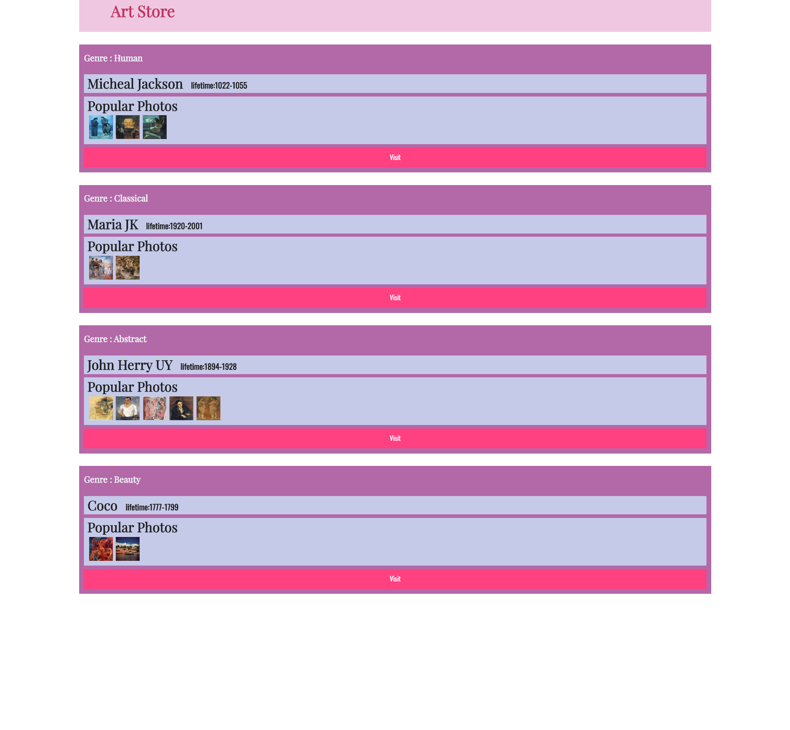

# lab7设计文档 
 
这次的js文件提供了works数组，数组每个元素都是一个map。于是就可以用for of对其进行遍历。 
首先用createElement创建div，作为所有内容的容器，并将其类设置为item（这次lab大多数内容可以从css文件中找到提示）   
works的每个元素为work，一开始work[tips]之类总是显示undefine，之后发现work["tips"]就解决了。  
一开始为了设置h4，h3等元素之内的text使用了firstChild.appendData()，但报错了，提示undefine没有appendData方法。发现其实一开始没有文本内容。所以后来直接使用innerText，简单快捷。 
inner-box也是用的div元素。第一个小块内将第二个标题（存活的时间）放在了第一个标题里面（放在里面外面区别不大），然后display：inline使其在同一行。这里发现这个h5的style还是要重新设置过。。 
整个过程本来想用insertChild，但后来发现只用appendChild就行了。总之就是不断地document.createElement()接item.appendChild()  
这里的图片似乎不要求剪裁，所以直接把image的className设置为photo。 
最后的document.getElementsByClassName()方法生成的其实是数组，一开始没注意，报错了才发现。于是加上了[0]。  

